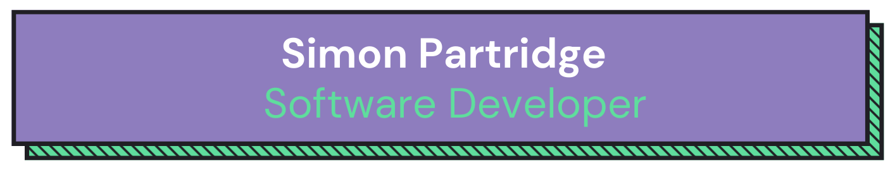

Hi, I'm Simon 👋

- I’m an enthusiastic and industrious software developer with a knack for learning quickly and passion for problem-solving.

- My main experience is in delivering impactful UI/UX solutions built with technologies including React, Next.js, TypeScript and TailwindCSS to major international clients.

- I pride myself on being an excellent communicator, owing to a diverse background in editing, teaching, and scientific research, and am adept at improving team processes and outcomes using a collaborative mindset.

- I'm currently working in my first software development role, where my achievements and contributions have been recognised by two promotions in quick succession.

- Background: After obtaining a PhD in Chemistry, I travelled the world for several years, working remotely as a copy editor. To find more exciting and creative work, I earned a place at a JavaScript development bootcamp in 2022, which kickstarted a new adventure in the world of code.

- To find out more, please view my [Portfolio](https://www.simonpartridge.me/)

- Or contact me through [LinkedIn](https://www.linkedin.com/in/simonpartridge86/)

---

## Technologies I've worked with:

<!--Badges from https://badges.pages.dev/-->

### Languages & Frameworks:

### Styling & Design:

### CI/CD & DevOps:

### Testing:

### Other Tools:

