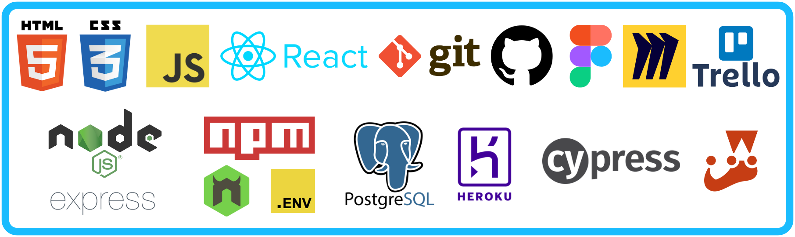

## **Hi, I'm Simon** 👋

After travelling the world and working remotely for several years, I wanted a new career challenge. As a Doctor of Chemistry, friends suggested using my skills to break bad, but instead I chose to learn code.

I've been learning full-stack JavaScript development at School of Code, a brilliant UK-based online bootcamp, since April 2022 👨‍🎓

From August 2022, I'll be seeking job opportunities as a junior developer 👨‍💻

You can find me on [LinkedIn](https://www.linkedin.com/in/simon-partridge-06819951/), [GitHub](https://github.com/simonpartridge86), and [Twitter](https://twitter.com/simonisworking)

<!-- Add paragraph about why I was attracted to coding. See interview answers for inspiration-->

<!-- Also add links to #100daysofcode repo and SoC diary repo -->

---
## Technologies I've learned so far:

---
## My Links:
 &nbsp;&nbsp;
 &nbsp;&nbsp;

---
[Return to Top](#hi-im-simon-👋)

<!--
**simonpartridge86/simonpartridge86** is a ✨ _special_ ✨ repository because its `README.md` (this file) appears on your GitHub profile.

Here are some ideas to get you started:

- 🔭 I’m currently working on ...
- 🌱 I’m currently learning ...
- 👯 I’m looking to collaborate on ...
- 🤔 I’m looking for help with ...
- 💬 Ask me about ...
- 📫 How to reach me: ...
- 😄 Pronouns: ...
- ⚡ Fun fact: ...
-->
